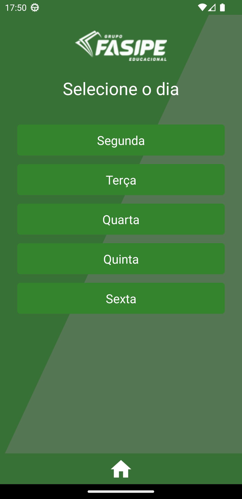
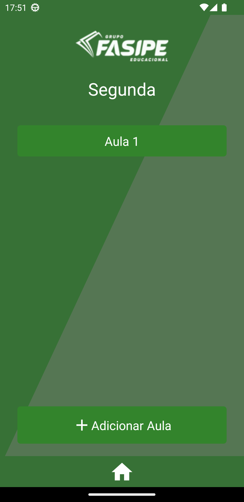
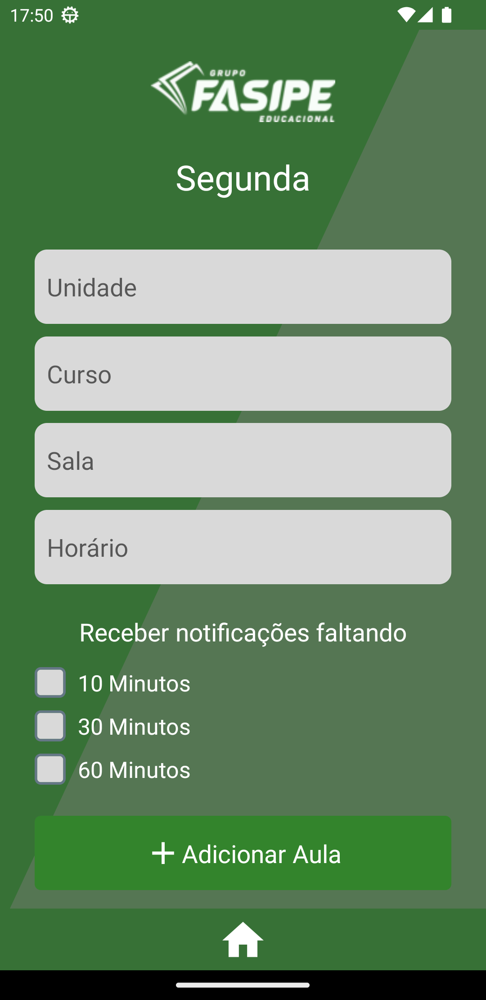
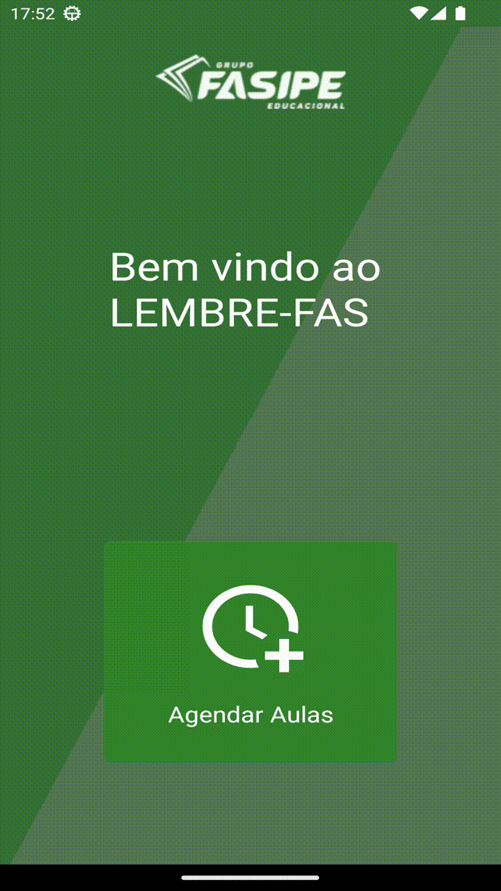

<!-- Banner Image -->

<p align="center">
  <a>
   
    <h1 align="center">LEMBRE FAS</h1>
  </a>
</p>

- [Overview](#overview)
- [Uso](#uso)
- [Capturas](#capturas)
- [Autor](#autor)
--- 
## Overview

## Uso

O projeto foi desenvolvido utilizando React Native e Expo. Será necessário estar com o ambiente configurado para rodar os comandos.
<br>[Documentação Expo](https://docs.expo.dev/get-started/installation/) e [Documentação React Native](https://reactnative.dev/docs/environment-setup)

Instalar as depedências
```bash
yarn install
```

Rodar bundler do Expo
```
npx expo start
```

> Em seu smartphone baixe o app Expo e leia o QRCode exibido no processo anterior. 


## Capturas







## Autor
